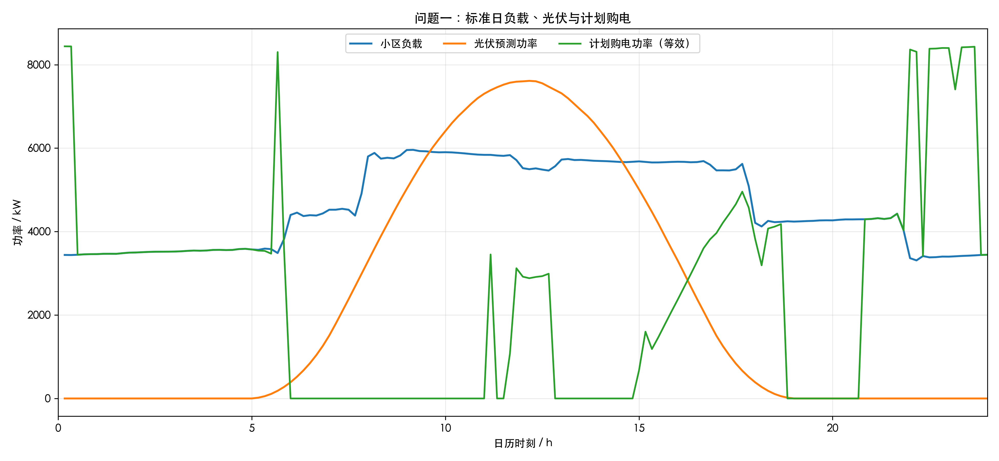
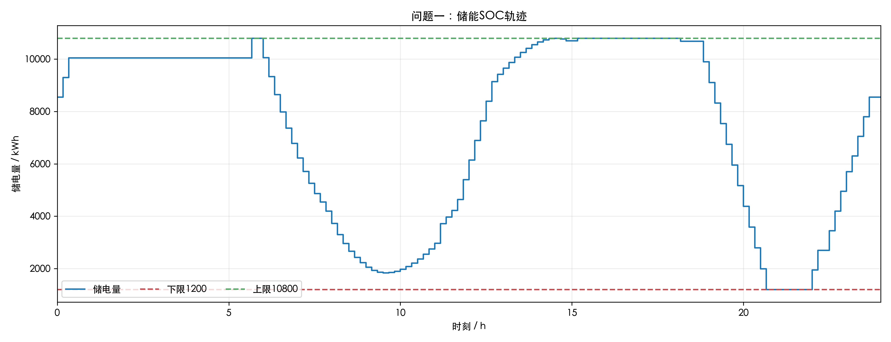

# 问题一：基于混合整数线性规划的微网日内经济调度

## 1. 问题概述

题目要求在每天0:00，依据标准日电价、负荷与光伏预测，制定144个10分钟时段的计划购电策略；小区负载必须满足，且0:00与24:00储电量相同，并使全天购电费用最小。本节仅使用附件1清洗后的标准日表，不涉及问题二、三。

## 2. 数据与假设

使用`attachment1_standard_day.csv`的144条记录。原始宽表已转为长表，功率按$E=P/6$转换为10分钟区间电量；本模型直接使用既有`load_kwh`、`pv_forecast_kwh`，不重复换算。附件1的时间标签是区间右端点：`00:10`对应00:00–00:10，…，`0:00+1`对应23:50–24:00。因此建模输入严格保留附件原序，未循环移动任何一行。

假设外部电网可按电价无限购电、不能售电；多余光伏只能弃光。充电和放电的单程效率均取0.9；充电量$C_t$为输入储能设备侧的电量，放电量$D_t$为储能设备输出至微网的电量。初始储电量$S_0$未被题意指定，因此作为[1200,10800] kWh内的决策变量，并以$S_{144}=S_0$实现循环运行。

## 3. 模型建立

令$t=1,\ldots,144$。$L_t,P_t,p_t$分别为负载电量(kWh)、光伏预测电量(kWh)、电价(元/kWh)；$G_t,C_t,D_t,W_t,S_t$依次为购电、充电、放电、弃光和期末储电量，单位均为kWh；$z_t$为充电状态二元变量。

目标函数为

$$\min\ \sum_t p_tG_t.$$

约束为

$$G_t+P_t+D_t=L_t+C_t+W_t,$$
$$S_t=S_{t-1}+0.9C_t-D_t/0.9,$$
$$1200\le S_t\le10800,\quad 0\le C_t\le833.333333z_t,\quad 0\le D_t\le833.333333(1-z_t),$$
$$S_{144}=S_0,\quad G_t,W_t\ge0,\quad z_t\in\{0,1\}.$$

采用`scipy.optimize.milp`（HiGHS）两阶段求解：第一阶段最小化购电费，得到35118.598589元；第二阶段加入购电费不高于第一阶段最优值加1e-05元的约束，最小化$\sum_t(C_t+D_t)$以消除同成本的不必要循环。求解器返回：Optimization terminated successfully. (HiGHS Status 7: Optimal)。

## 4. 计算结果

全天计划购电量为**59482.699 kWh**，全天购电费为**35118.599 元**；最优初始/末端储电量均为**8550.000 kWh**。预测光伏自用55482.836 kWh，弃光0.000 kWh。

表1 指定时段购电量及全天结果

| 时段 | 计划购电量 / kWh |
|---|---:|
| 10:00–10:10 | 0.000 |
| 12:00–12:10 | 480.412 |
| 14:00–14:10 | 0.000 |
| 16:00–16:10 | 445.432 |
| 18:00–18:10 | 531.894 |
| 20:00–20:10 | 0.000 |
| 全天 | 59482.699 |
| 全天购电费 / 元 | 35118.599 |

表2 分时段充放电量与循环储电量

| 时段 | 累计充电量 / kWh | 累计放电量 / kWh |
|---|---:|---:|
| 00:00–04:00 | 1666.667 | 0.000 |
| 04:00–08:00 | 833.333 | 6365.841 |
| 08:00–12:00 | 4787.964 | 1702.997 |
| 12:00–16:00 | 5286.035 | 91.101 |
| 16:00–20:00 | 0.000 | 5780.132 |
| 20:00–24:00 | 8166.667 | 2859.868 |
| 0:00储电量 | 8550.000 | — |
| 24:00储电量 | 8550.000 | — |

图1显示购电主要转移至低价时段，光伏高发时段优先供负荷并为储能充电；图2显示SOC始终处于1200–10800 kWh运行区间且日末回到初始水平。自由$S_0$方案的费用为35118.599元；固定$S_0=6000$ kWh对照方案费用为35126.949元，差异为8.350000元，说明本例中初始SOC约束对最优费用的影响为该数值。

## 5. 验证与结论

最大时段电量平衡残差为1.137e-13 kWh，最大SOC转移残差为8.598e-13 kWh；循环SOC残差为0.000e+00 kWh；Excel与CSV全天购电量残差为3.052e-08 kWh。六个分段充、放电汇总均覆盖24个时段且无遗漏，不存在同时充放电时段，充放电上限、SOC边界、购电费用和Excel写入均逐项复核通过。完整逐时计划见`outputs/question1/question1_full_schedule.csv`。

模型是透明可复核的MILP，能严格表达功率/能量、效率和循环储能约束。局限在于光伏预测、电价和负荷被视为确定值，且未建模储能衰减、需量电费及外网售电；这些可在后续问题的滚动优化中扩展。

模板填表按时间段键匹配：模板`00:10–00:20`取日历解同名时段；模板最后一行`0:00+1–0:10+1`取代表日循环策略的`00:00–00:10`。原模板的工作表名称、顺序、表头、格式和布局均未修改。
